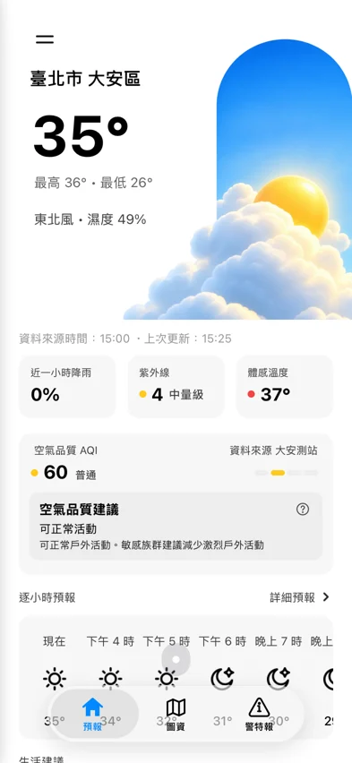
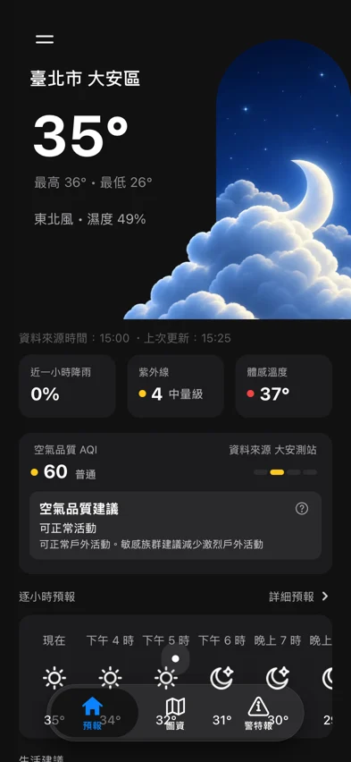
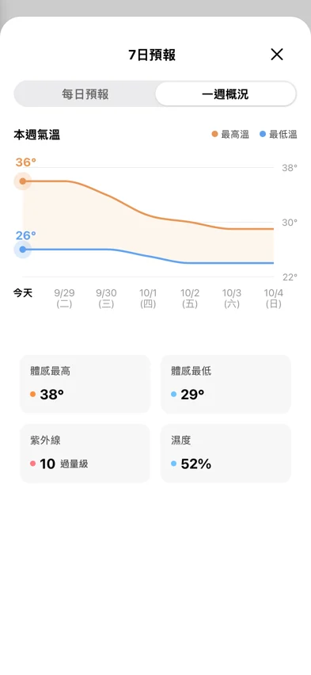
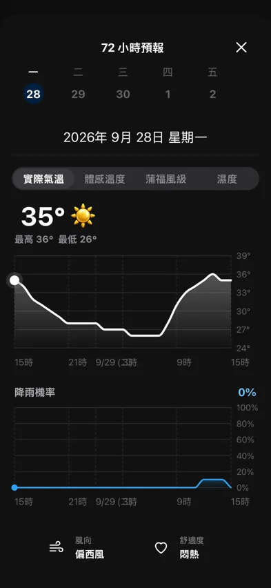
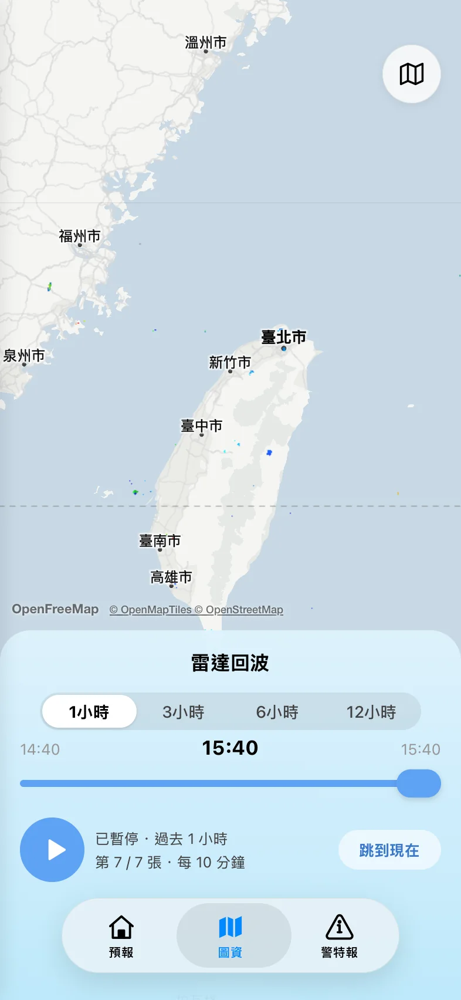
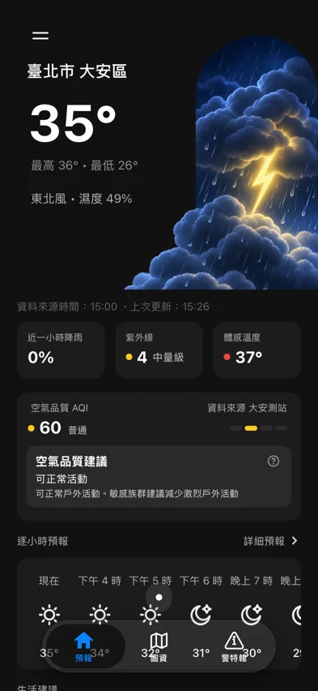

# 台灣即時天氣 🌦️

> 「比內建準很多！」 — the original app, about itself, very humbly

A web rebuild of the iOS app **天氣預報 – 台灣即時天氣預報**, recreated screen by screen
until our WebKit screenshots and the app's own screenshots stopped arguing with each other.
It is a plain Vite + React site with no server, no database, no login, and absolutely no
opinion about whether you should bring an umbrella. (Bring an umbrella. It's Taiwan.)

**Live:** https://davidyen1124.github.io/taiwan-weather-live/


| 預報 (light) | 預報 (dark) | 一週概況 | 72 小時預報 | 圖資 · 雷達回波 | 雷陣雨 at night |
| --- | --- | --- | --- | --- | --- |
|  |  |  |  |  |  |

## What's inside

| Screen | What it does |
| --- | --- |
| 預報 | Swipeable pages per saved location, a hero that collapses as you scroll, 近一小時降雨 / 紫外線 / 體感溫度, AQI with advice, hourly strip, 生活建議 cards, 7-day list, rain/wind/pressure, sunrise–sunset arc |
| 7日預報 | 每日預報 (day/night) and 一週概況 (drag the chart, it's fun) |
| 72 小時預報 | 實際氣溫 / 體感溫度 / 蒲福風級 / 濕度 charts plus 降雨機率 |
| 圖資 | 雷達回波 playback on a map, 降雨雷達 (樹林 / 南屯 / 林園), 溫度分布圖 + 有多熱全國排行 |
| 警特報 | Active CWA advisories with an in-app web view |
| Drawer & 設定 | Add 368 districts or 151 mountains, reorder or delete them, pick light/dark, reorder or hide home sections |

Things deliberately left out: onboarding (it asks for your location and gets out of the way),
ads, the VIP paywall (every "VIP" feature here is free — you're welcome), push notifications,
widgets, Live Activities and the Apple Watch. A website on your wrist is a cry for help.

## The sky got an upgrade

The original app draws its hero with six flat Lottie animations. We checked: they really are
that flat — the JSON files in its bundle are byte-identical to what we first shipped. So the
hero is now hand-picked generated artwork (OpenAI `gpt-image` via Codex's `imagegen` skill),
one image per weather family and time of day:

| | 晴 | 晴時多雲 | 多雲 | 陰 | 雨 | 雷陣雨 |
| --- | --- | --- | --- | --- | --- | --- |
| Day | clear-day | partly-clear-day | partly-cloudy-day | cloudy-day | rainy-day | thunder-day |
| Night | clear-night | partly-clear-night | partly-cloudy-night | cloudy-night | rainy-night | thunder-night |

The families mirror what the app supports (its asset catalog has clear / partly-clear /
partly-cloudy / rainy art for day and night, plus an overcast hero). Thunderstorms get their
own art here because CWA says 雷陣雨 roughly every summer afternoon, and it felt rude to
draw a polite drizzle for that.

Which icons were regenerated, and which weren't:

| Element | Decision | Why |
| --- | --- | --- |
| Hero sky (12 images) | Generated | Big illustrative raster art; the original is flat vector |
| Colour weather icons in the 7-day list, 生活建議 and sheets (10) | Generated as one sprite sheet so they match the hero | Illustrative, shown at 28–50 px |
| App icon, favicon, social preview | Generated | Raster branding assets |
| Hourly line glyphs, 生活建議 glyphs (短袖, 適合曬衣…), hamburger, chevron, search | Kept the app's vector glyphs | Monochrome template icons must tint for dark mode and stay crisp at 20–26 px |
| Tab bar, settings, share, sunrise/sunset and other UI symbols | Kept as SVG | UI chrome belongs in code, not in pixels |

## Run it

```bash
npm install
npm run dev
```

Then open http://localhost:5173/taiwan-weather-live/. `npm run build` produces a static
`dist/` that any static host can serve; pushes to `main` deploy to GitHub Pages via
`.github/workflows/deploy.yml`.

## How "pixel parity" was measured (a.k.a. how many screenshots is too many)

1. The iPhone app was installed on an Apple Silicon Mac and every screen was captured in
   light and dark mode (58 captures).
2. Exact colours were read straight out of the app's `WeatherUIKit.ColorPalette`
   (including the AQI, UV and feels-like temperature scales), so `#F7F7F7` is not a guess.
3. A Playwright/WebKit harness renders the site at the same 393-pt width and scale, then
   diffs it against each capture. Fonts, offsets and chart geometry were nudged until the
   red pixels mostly went home. The remaining differences are the live weather itself,
   which refuses to hold still for screenshots — and, now, the prettier sky.

## Data & credits

- Weather data: the `api.taiwanweather.app` API used by the original app, which aggregates
  中央氣象署 (CWA) and 環境部 open data.
- Map tiles: [OpenFreeMap](https://openfreemap.org) / © OpenMapTiles © OpenStreetMap contributors.
- The monochrome glyphs and the location-permission illustration come from the original
  天氣預報 app by Shuttle Network Limited; the hero art, colour weather icons, app icon and
  social preview are generated for this project. This is an unofficial fan rebuild and is not
  affiliated with the app's developer. If you're the developer and want something changed,
  open an issue and it will be changed faster than a 午後雷陣雨.

## FAQ

**Is it accurate?** It is exactly as accurate as the sky allows.

**Why is it called live?** Because 35° in September is, technically, still alive.

**Can I use it on desktop?** Yes. It politely pretends to be a phone.
